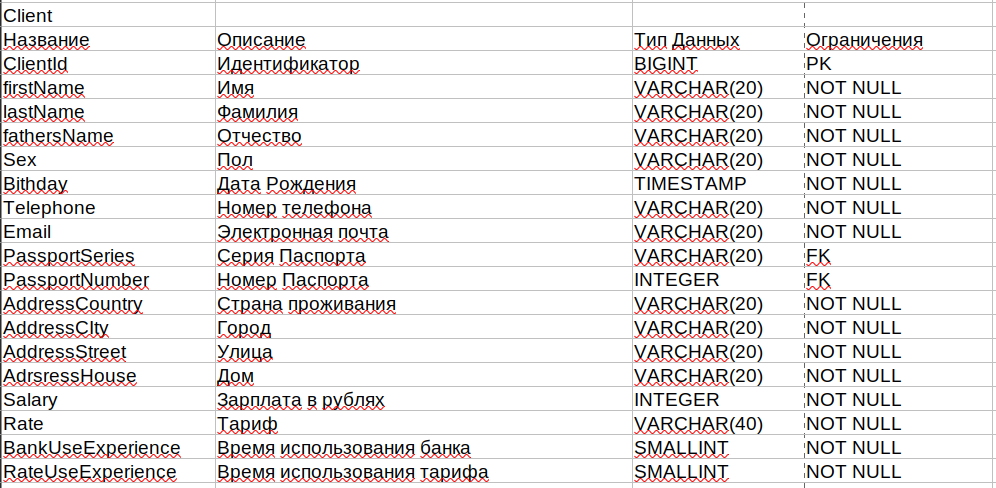

# Описание проекта

## Предметная область

**Банковская система.** Мы анализируем время наибольшей активности клиентов и пересматриваем условия кредитования.

## Цели проекта

**Для чего нужна наша база данных?** Мы храним большой объем данных о сотрудниках, клиентах, банкоматах, банках и системе обслуживания клиентов. Эти данные используются для:

- Оптимизации процесса выдачи кредитов
- Построения графиков работы сотрудников
- Оценки времени обслуживания банкоматов
- Разработки инвестиционных рекомендаций клиентам

## Описание сущностей

**Сущности и их описание:**

- **CustomerService**: Сервис для установки и фиксации времени приема клиента.
- **Bank**: Информация о банке.
- **Employee**: Работник банка.
- **Client**: Клиент банка.
- **CashMachine**: Банкомат.

## Концептуальное проектирование

1. Определение предметной области
2. Разбиение на основные сущности
3. Определение связей между сущностями
4. Картинка в ER-нотации ("Воронья лапка") без явных атрибутов

## Логическое проектирование

1. Разбиение на детализированные сущности согласно выбранной модели данных и нормализации
2. Определение атрибутов
3. Определение связей между сущностями по атрибутам (явное указание PK, FK)
4. Картинка в ER-нотации ("Воронья лапка") с явными атрибутами

## Физическое проектирование

1. Создание схемы базы данных для конкретной СУБД
2. Результат физического проектирования логической схемы - SQL-скрипт, с указанием типов всех атрибутов и ограничений

<!--  

-->
| Название       | Описание           | Тип Данных  | Ограничения |
|----------------|--------------------|-------------|-------------|
| BankId         | Идентификатор       | BIGINT      | PK          |
| BankName       | Название банка      | VARCHAR(20) | FK          |
| WorkSchedule   | Расписание работы   | VARCHAR(20) | NOT NULL    |
| AddressCountry | Страна проживания   | VARCHAR(20) | NOT NULL    |
| AddressCity    | Город               | VARCHAR(20) | NOT NULL    |
| AddressStreet  | Улица               | VARCHAR(20) | NOT NULL    |
| AddressHouse   | Дом                 | VARCHAR(20) | NOT NULL    |

| Название           | Описание                       | Тип Данных  | Ограничения |
|--------------------|--------------------------------|-------------|-------------|
| ClientId           | Идентификатор                  | BIGINT      | PK          |
| firstName          | Имя                            | VARCHAR(20) | NOT NULL    |
| lastName           | Фамилия                        | VARCHAR(20) | NOT NULL    |
| fathersName        | Отчество                       | VARCHAR(20) | NOT NULL    |
| Sex                | Пол                            | VARCHAR(20) | NOT NULL    |
| Birthday           | Дата Рождения                  | TIMESTAMP   | NOT NULL    |
| Telephone          | Номер телефона                 | VARCHAR(20) | NOT NULL    |
| Email              | Электронная почта              | VARCHAR(20) | NOT NULL    |
| PassportSeries     | Серия Паспорта                 | VARCHAR(20) | FK          |
| PassportNumber     | Номер Паспорта                 | INTEGER     | FK          |
| AddressCountry     | Страна проживания              | VARCHAR(20) | NOT NULL    |
| AddressCity        | Город                          | VARCHAR(20) | NOT NULL    |
| AddressStreet      | Улица                          | VARCHAR(20) | NOT NULL    |
| AdressHouse        | Дом                            | VARCHAR(20) | NOT NULL    |
| Salary             | Зарплата в рублях              | INTEGER     | NOT NULL    |
| Rate               | Тариф                          | VARCHAR(40) | NOT NULL    |
| BankUseExperience  | Время использования банка      | SMALLINT    | NOT NULL    |
| RateUseExperience  | Время использования тарифа     | SMALLINT    | NOT NULL    |

